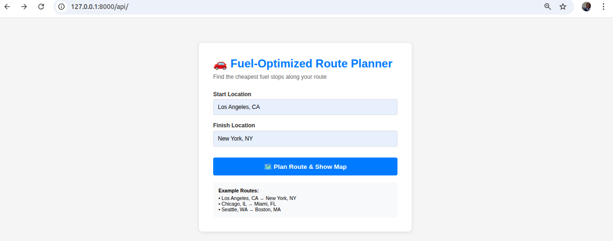
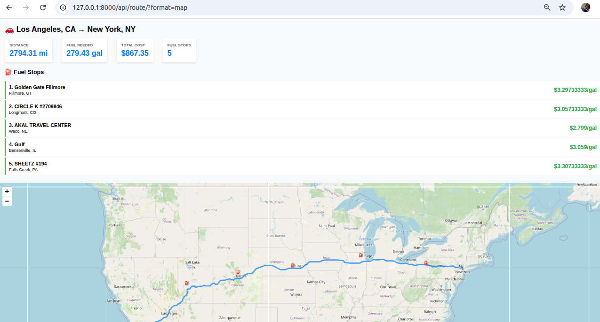

# Fuel-Optimized Route Planner API

Django REST API that calculates optimal fuel stops along a route based on cost and vehicle range.

## Core Functionality
1. **Route Planning**: Takes start and finish locations within the USA
2. **Fuel Optimization**: Finds cheapest fuel stops along the route
3. **Range Management**: Accounts for 500-mile vehicle range
4. **Cost Calculation**: Returns total fuel cost at 10 MPG
5. **Map Visualization**: Returns interactive HTML map with route and fuel stops

## Screenshots

### Web Interface


### Map Visualization


## Setup

1. Install dependencies:
```bash
pip install -r requirements.txt
```

2. Get a free OpenRouteService API key:
   - Visit https://openrouteservice.org/dev/#/signup
   - Sign up for a free account
   - Copy your API key

3. Create `.env` file:
```bash
cp .env.example .env
```
Then edit `.env` and add your API key:
```
OPENROUTE_API_KEY=your_actual_api_key_here
```

4. Pre-geocode fuel stations (first time only):
```bash
python manage.py geocode_stations
```
This creates a cache file for fast API startup.

5. Run migrations:
```bash
python manage.py migrate
```

6. Start server:
```bash
python manage.py runserver
```

## API Endpoints
- `GET /api/` - Web form interface for easy route planning
- `POST /api/route/` - JSON API endpoint
- `POST /api/route/?format=map` - HTML map visualization
- `GET /api/docs/` - Swagger UI documentation
- `GET /api/redoc/` - ReDoc documentation
- `GET /api/schema/` - OpenAPI schema

## Tree

```
api/
├── views.py                    # Main API endpoints
├── serializers.py              # Request/response schemas
├── fuel_optimizer.py           # Fuel stop optimization logic
├── renderers.py                # HTML map renderer
├── urls.py                     # API URL routing
└── management/
    └── commands/
        └── geocode_stations.py # Pre-geocoding command

drf/
└── settings.py                 # Updated with CORS, DRF, and drf-spectacular

templates/
├── route_map.html              # Interactive map template
└── route_form.html             # User input form

requirements.txt                # Python dependencies
.env.example                    # Environment variable template
.gitignore                      # Git ignore rules
README.md                       # Setup and usage instructions
demo.html                       # Standalone demo page
test_api.py                     # API test script
postman_collection.json         # Postman test collection
```

## Key Components

1. **views.py** - Main API views
   - OptimalRouteView: Geocodes locations, calls OpenRouteService, finds fuel stops
   - RouteFormView: Simple web form for user input
   - Supports both JSON and HTML map responses

2. **fuel_optimizer.py** - Fuel stop optimization
   - Loads fuel prices from CSV
   - Geocodes stations (with caching)
   - Finds cheapest stations within 50 miles of refuel points
   - Calculates total fuel cost

3. **serializers.py** - Request/response validation
   - Validates input locations
   - Structures response data

4. **renderers.py** - Custom HTML map renderer
   - Renders interactive map from route data
   - Works in Postman, browsers, and all HTTP clients

## API Usage

### Web Interface (Easiest)
Simply visit: **http://localhost:8000/api/**

Enter your start and finish locations, click "Plan Route & Show Map" to see:
- Interactive map with the route drawn
- Fuel stop markers with prices
- Total distance, fuel cost, and gallons needed

### API Endpoint
`POST /api/route/`

**Get JSON response:**
```bash
curl -X POST http://localhost:8000/api/route/ \
  -H "Content-Type: application/json" \
  -d '{"start": "Los Angeles, CA", "finish": "New York, NY"}'
```

**Get HTML map view:**
```bash
curl -X POST "http://localhost:8000/api/route/?format=map" \
  -H "Content-Type: application/json" \
  -d '{"start": "Los Angeles, CA", "finish": "New York, NY"}'
```

**In Postman:**
1. Set method to POST
2. URL: `http://localhost:8000/api/route/?format=map`
3. Body (raw JSON): `{"start": "Los Angeles, CA", "finish": "New York, NY"}`
4. Click Send - the map will display in the response preview
   
- You may import the `postman_collection.json` file 

Or visit in browser: `http://localhost:8000/api/route/?format=map` (POST form data)

### Request Body
```json
{
    "start": "Los Angeles, CA",
    "finish": "New York, NY"
}
```

### JSON Response
```json
{
    "route_geometry": {
        "type": "LineString",
        "coordinates": [[lon, lat], ...]
    },
    "distance_miles": 2789.45,
    "fuel_stops": [
        {
            "name": "PILOT TRAVEL CENTER",
            "address": "I-40, EXIT 280",
            "city": "Oklahoma City",
            "state": "OK",
            "price": 3.30,
            "lat": 35.4676,
            "lon": -97.5164
        }
    ],
    "total_fuel_cost": 975.31,
    "total_gallons": 278.95
}
```

## Features

- Single API call to OpenRouteService for routing
- Optimal fuel stops based on:
  - 500-mile vehicle range
  - Cheapest fuel prices within 50 miles of refuel point
- Returns GeoJSON route geometry for map display
- Calculates total fuel cost at 10 MPG

## Example Request

```bash
curl -X POST http://localhost:8000/api/route/ \
  -H "Content-Type: application/json" \
  -d '{"start": "San Francisco, CA", "finish": "Miami, FL"}'
```

## API Documentation

Interactive API documentation is available at:
- **Swagger UI**: http://localhost:8000/api/docs/
- **ReDoc**: http://localhost:8000/api/redoc/
- **OpenAPI Schema**: http://localhost:8000/api/schema/

